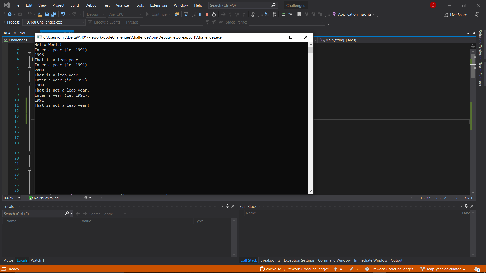
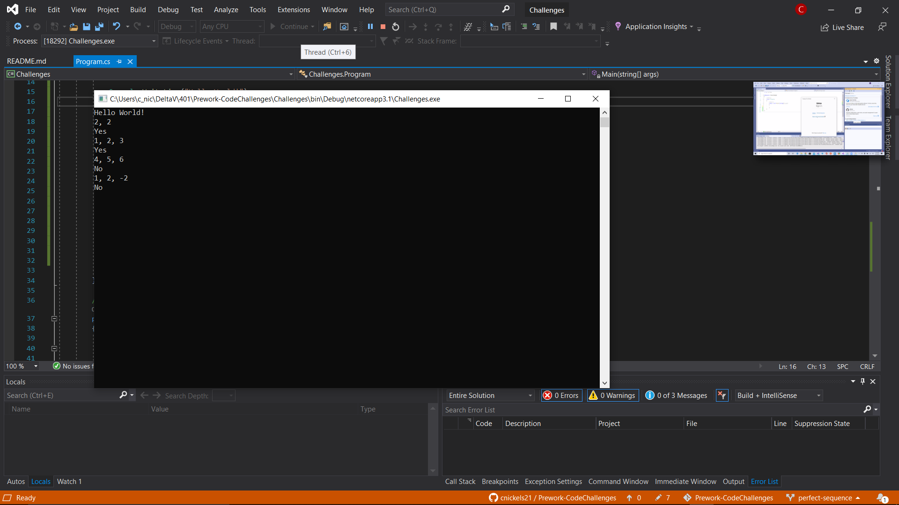
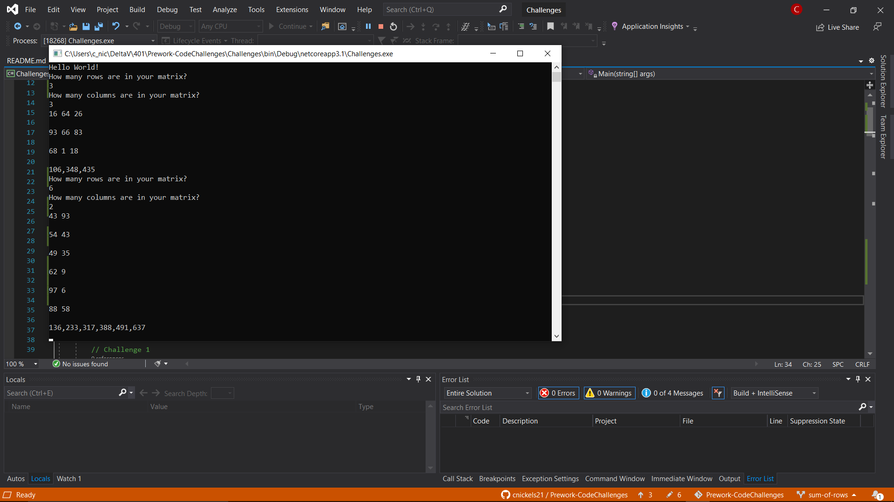

# Prework-CodeChallenges

DSA landing pad for 401 code challenges.

## Challenge 1 -- Array Max Result

Create an array of 5 numbers based on user input.  Then ask the user for a number from that array.  Loop through the array and count how many times that number exists in the array.  Return that number times how many times it appeared in the array.

## Challenge 2 -- Leap Year Calculator

When a user enters a year, calculate whether that year is a leap year or not.

## Challenge 3 -- Perfect Sequence

Given an array, define whether that array is a perfect sequence or not.  Negative numbers automatically create NOT a perfect sequence, but to define a perfect sequence the sum of the array is equal to the product of the array.

## Challenge 4 -- Sum of Rows

Create a function that builds a matrix \(2d array\) of either random numbers or input numbers from the user and then returns an array defining the sum of each row in the matrix.

