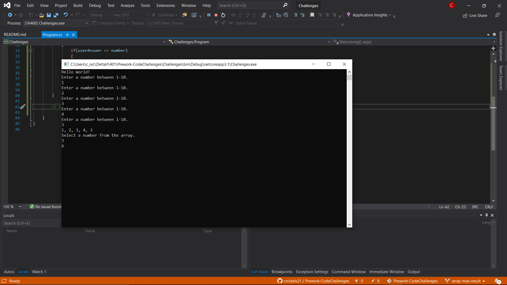

# Prework-CodeChallenges

DSA landing pad for 401 code challenges.

## Challenge 1 -- Array Max Result

Create an array of 5 numbers based on user input.  Then ask the user for a number from that array.  Loop through the array and count how many times that number exists in the array.  Return that number times how many times it appeared in the array.

